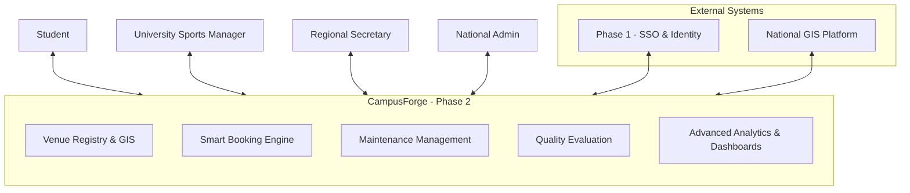
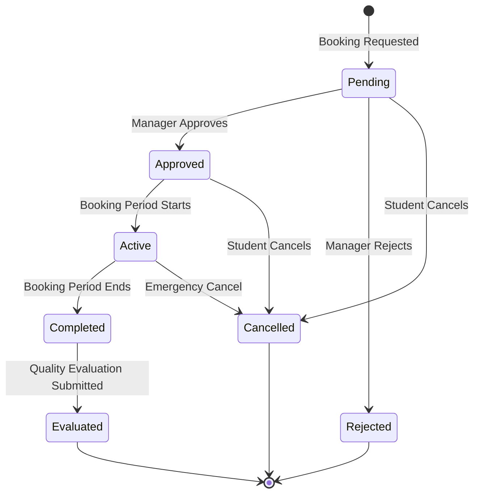
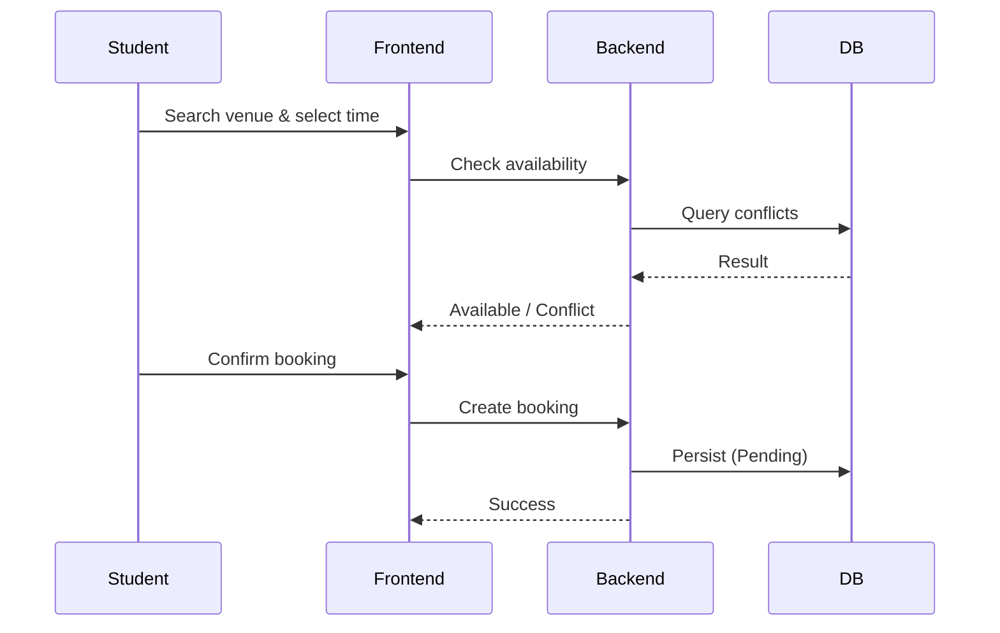
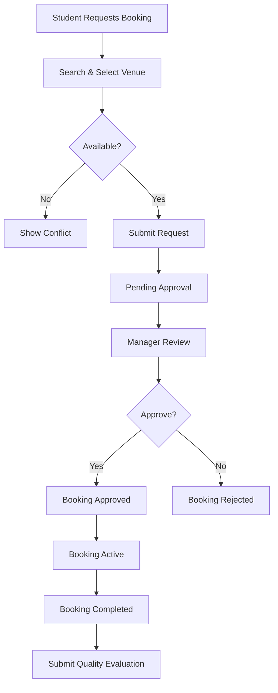

# سامانه مدیریت اماکن ورزشی دانشگاهی # CampusForge
**Phase 2: Intelligent Sports Venue Management System**


**A National Digital Platform for University Sports Infrastructure**

---

## 🌟 Executive Summary

**CampusForge** represents a transformative leap in how Iranian universities manage their sports facilities. As **Phase 2** of the national *Comprehensive University Sports Ecosystem*, it delivers a modern, intelligent, and unified platform that connects students, university administrators, regional authorities, and national policymakers.

By digitizing venue management, smart booking, maintenance, and quality evaluation, CampusForge aims to maximize infrastructure utilization, enhance student experience, and enable data-driven governance at scale.

---

## 📊 Official Reference Architecture


*The foundational information architecture from the project charter defining venue registration, reservation, GIS integration, and reporting flows.*

---

## 🎯 Vision & Objectives

### Strategic Goals
- **Maximize Asset Utilization** — Turn underused facilities into vibrant hubs of activity
- **Student-Centric Experience** — Make sports facility access seamless and delightful
- **Operational Excellence** — Replace manual processes with intelligent automation
- **National Visibility** — Provide real-time insights for evidence-based policy making

### Key Performance Indicators
- Average venue utilization rate **≥ 70%**
- Student satisfaction score **≥ 4.3/5**
- Booking approval time **≤ 24 hours**
- System availability **≥ 99.5%**

---

## 🗺️ System Context



---

## ✨ Core Capabilities

- **Rich Venue Registry** with GIS mapping, photo galleries, technical specifications, and operating schedules
- **Intelligent Booking System** with real-time availability and smart conflict detection
- **Comprehensive Maintenance Management** (corrective + preventive)
- **Automated Quality Evaluation** with post-use feedback and scoring
- **Role-Based Analytics Dashboards** for all stakeholder levels

---

## 📐 Architecture & Design Diagrams

### 1. Use Case Diagram – Full Booking Lifecycle

```mermaid
usecase
    actor "Student" as Student
    actor "University Sports Manager" as UnivManager
    actor "Regional Secretary" as Regional
    actor "National Admin" as National

    rectangle "CampusForge" {
        usecase "Search & View Venues on Map" as UC1
        usecase "Create New Booking" as UC2
        usecase "Manage My Bookings" as UC3
        usecase "Approve/Reject Bookings" as UC4
        usecase "Cancel Booking" as UC5
        usecase "Report Maintenance Issues" as UC6
        usecase "View Reports & Dashboard" as UC7
    }

    Student --> UC1 & UC2 & UC3 & UC5
    UnivManager --> UC4 & UC6 & UC7
    Regional --> UC4 & UC7
    National --> UC7
```

### 2. Use Case Diagram – Quality Evaluation

```mermaid
usecase
    actor "Student" as Student
    actor "University Sports Manager" as Manager

    rectangle "Quality Evaluation" {
        usecase "Submit Post-Use Evaluation" as E1
        usecase "View Venue Quality Metrics" as E2
        usecase "Analyze Quality Trends" as E3
        usecase "View Common Issues Report" as E4
    }

    Student --> E1
    Manager --> E2 & E3 & E4
```

### 3. State Diagram – Booking Lifecycle



### 4. Sequence Diagram – Booking Flow



### 5. Activity Diagram – Booking Process



---

## 🛠️ Technical Stack

- **Frontend**: Next.js 16 (App Router), TypeScript, Tailwind, shadcn/ui, Leaflet, Recharts
- **Backend**: Nest.js, Prisma, PostgreSQL, Redis
- **Architecture**: Scalable, RBAC-first, Microservices-ready

---

## 📋 Non-Functional Requirements

- **Scalability**: 10,000+ concurrent users
- **Performance**: p95 < 800ms for critical flows
- **Availability**: 99.5%
- **Security**: Enterprise-grade authentication, authorization, and audit
- **Usability**: Full RTL + Persian, mobile-first, WCAG 2.1 AA

---

## 🗓️ Implementation Roadmap

**Foundation** → Weeks 1-2  
**Booking Engine** → Weeks 3-6 *(Highest complexity)*  
**Maintenance & Evaluation** → Weeks 7-8  
**Analytics & Polish** → Weeks 9-10  
**Testing & Deployment** → Weeks 11-12

---

**This repository is the single source of truth for CampusForge Phase 2 design.**


**Last Updated:** May 25, 2026
| University Sports Venue Management


## Documentation

**Start here:** [docs/PHASE2-DOCUMENTATION.md](./docs/PHASE2-DOCUMENTATION.md)

| Document | Description |
|----------|-------------|
| [docs/README.md](./docs/README.md) | Documentation index |
| [docs/FEATURES.md](./docs/FEATURES.md) | Feature list & priorities |
| [docs/DATA-MODELS.md](./docs/DATA-MODELS.md) | Types & Prisma schema |
| [docs/API-SPEC.md](./docs/API-SPEC.md) | REST API contracts |
| [docs/DEPLOYMENT.md](./docs/DEPLOYMENT.md) | Production deployment |
| [docs/USECASES.md](./docs/USECASES.md) | Use case diagrams (Persian) |
| [docs/STATE-DIAGRAM.md](./docs/STATE-DIAGRAM.md) | Booking state lifecycle |
| [docs/USER-STORIES.md](./docs/USER-STORIES.md) | User stories by role |
| [docs/BPMN.md](./docs/BPMN.md) | BPMN-style process flows |

## Quick start

```bash
pnpm install
pnpm dev
```

Open http://localhost:3000

