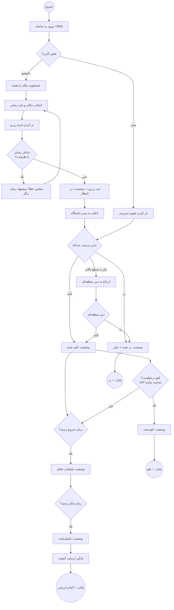

# BPMN Process Flows | گردش‌کارهای فرآیندی

**سامانه ارزیابی و نظارت و مدیریت اماکن** — فاز ۲  
**قالب:** نمودار جریان BPMN-style با Mermaid (`flowchart`)

> Mermaid از BPMN 2.0 خالص پشتیبانی نمی‌کند؛ از نمادهای استاندارد جریان (شروع، فعالیت، تصمیم، پایان) و زیرگراف‌های نقش استفاده شده است.

---

## فرآیند ۱: رزرو مکان (Booking / Reservation Process)

### شرح کوتاه

کاربر مکان و بازه زمانی را انتخاب می‌کند؛ سیستم تداخل را بررسی می‌کند؛ مدیر تأیید یا رد می‌کند؛ در زمان مقرر رزرو فعال و سپس تکمیل می‌شود.

### نمودار



### نقاط تصمیم کلیدی

| گام | شرط | خروجی |
|-----|------|--------|
| A6 | overlap / capacity / maintenance | بازگشت به انتخاب زمان |
| D1 | سیاست دانشگاه | approved / rejected |
| D5 | `hoursUntilStart >= 24` | cancelled یا ادامه |

---

## فرآیند ۲: ارزیابی کیفیت (Quality Evaluation Process)

### شرح کوتاه

پس از تکمیل رزرو، سیستم به کاربر یادآوری می‌کند؛ کاربر امتیاز چندبعدی ثبت می‌کند؛ میانگین‌ها برای داشبورد و گزارش ملی به‌روز می‌شوند.

### نمودار

```mermaid
flowchart TB
    Start((شروع)) --> B1[رزرو به وضعیت تکمیل‌شده تغییر کرد]

    B1 --> B2{ارزیابی قبلاً ثبت شده؟}
    B2 -->|بله| EndSkip((پایان — بدون اقدام))
    B2 -->|خیر| B3[ارسال اعلان / badge در «رزروهای من»]

    B3 --> B4[کاربر باز کردن فرم ارزیابی]
    B4 --> B5[امتیاز ۱–۵: نظافت، تجهیزات، روشنایی، ایمنی، کلی]
    B5 --> B6{همه ابعاد پر شده؟}

    B6 -->|خیر| B7[نمایش خطای اعتبارسنجی]
    B7 --> B4

    B6 -->|بله| B8[ثبت اختیاری نظر و تصویر]
    B8 --> B9[POST /evaluations]
    B9 --> B10[به‌روزرسانی VenueQualityMetrics]
    B10 --> B11[flag: evaluationSubmitted = true]

    B11 --> B12{نمره کلی < آستانه؟}
    B12 -->|بله| B13[ایجاد هشدار برای مدیر دانشگاه]
    B12 -->|خیر| B14[ثبت در فید فعالیت داشبورد]

    B13 --> B15[مدیر: بررسی و ثبت درخواست نگهداری]
    B14 --> B16[تجمیع گزارش منطقه‌ای / ملی]
    B15 --> B16

    B16 --> EndOK((پایان — داده در KPI))

    subgraph نقش‌ها["نقش‌های درگیر"]
        direction LR
        R1[دانشجو — ثبت]
        R2[مدیر ورزش — پیگیری کیفیت پایین]
        R3[دبیر / مدیر ملی — گزارش]
    end
```

### داده‌های خروجی

| مرحله | موجودیت | API |
|-------|---------|-----|
| B9 | `VenueEvaluationDetailed` | `POST /evaluations` |
| B10 | `VenueQualityMetrics` | `GET /venues/:id/quality-metrics` |
| B16 | `DashboardKPIs.satisfactionScore` | `GET /dashboard/kpis` |

---

## جدول تطبیق فرآیند و وضعیت

| فرآیند | وضعیت‌های مرتبط | سند مرتبط |
|--------|-----------------|-----------|
| رزرو | pending → approved → active → completed | [STATE-DIAGRAM.md](./STATE-DIAGRAM.md) |
| ارزیابی | فقط پس از `completed` | [USECASES.md](./USECASES.md) § ۲ |

---

## پیوندها

- [STATE-DIAGRAM.md](./STATE-DIAGRAM.md)
- [USECASES.md](./USECASES.md)
- [API-SPEC.md](./API-SPEC.md) § ۴ و § ۶

---

*برای پیش‌نمایش: [mermaid.live](https://mermaid.live)*
