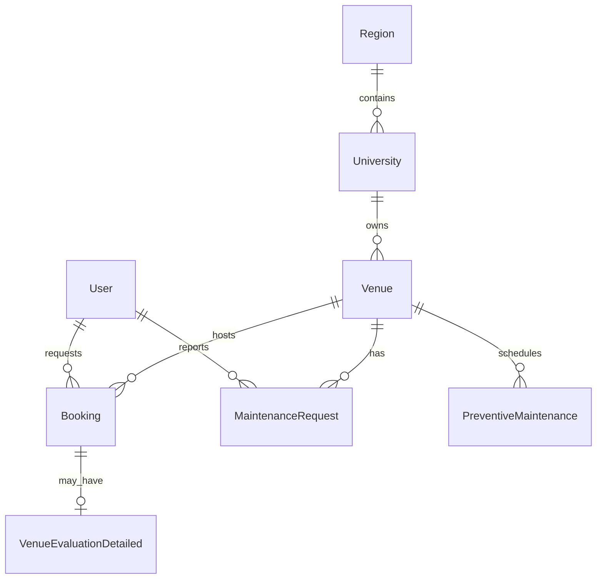

# Data Models | مدل‌های داده

**Source of truth (TypeScript):** `lib/types.ts`  
**Suggested ORM:** Prisma + PostgreSQL

---

## 1. Entity relationship overview



---

## 2. TypeScript domain types (summary)

### 2.1 Identity & scope

```typescript
type UserRole =
  | 'admin_national'
  | 'admin_regional'
  | 'university_manager'
  | 'facility_staff'
  | 'student'
  | 'athlete';

type RegionId =
  | 'region_tehran'
  | 'region_center'
  | 'region_south'
  | 'region_northwest';

interface User {
  id: string;
  name: string;
  email: string;
  role: UserRole;
  regionId?: RegionId;
  universityId?: string;
  avatar?: string;
}

interface University {
  id: string;
  name: string;
  nameFa: string;
  city: string;
  province: string;
  regionId: RegionId;
}
```

### 2.2 Venue

```typescript
type VenueType =
  | 'stadium' | 'gym' | 'pool' | 'court'
  | 'field' | 'track' | 'arena' | 'other';

type VenueStatus = 'active' | 'maintenance' | 'closed' | 'reserved';

interface Venue {
  id: string;
  name: string;
  nameFa: string;
  type: VenueType;
  status: VenueStatus;
  capacity: number;
  area: number;
  location: {
    address: string;
    addressFa: string;
    lat: number;
    lng: number;
    city: string;
    province: string;
  };
  facilities: Record<string, boolean>; // parking, lockerRooms, ...
  amenities: string[];
  images: string[];
  universityId: string;
  universityName: string;
  utilizationRate: number;
  operatingHours: OperatingHours[];
  rules: string[];
  rulesFa: string[];
  contactPhone: string;
  contactEmail: string;
  createdAt: Date;
  updatedAt: Date;
}
```

### 2.3 Booking

```typescript
type BookingStatus =
  | 'pending' | 'approved' | 'rejected' | 'cancelled' | 'completed';

type BookingPurpose =
  | 'class' | 'training' | 'competition' | 'event' | 'maintenance' | 'other';

interface Booking {
  id: string;
  venueId: string;
  venueName: string;
  userId: string;
  userName: string;
  universityId?: string;
  startTime: Date;
  endTime: Date;
  purpose: BookingPurpose;
  purposeDetail: string;
  status: BookingStatus;
  attendees: number;
  recurrence: 'none' | 'daily' | 'weekly' | 'monthly';
  approvedBy?: string;
  approvedAt?: Date;
  rejectionReason?: string;
  evaluationSubmitted?: boolean;
  createdAt: Date;
  updatedAt?: Date;
}
```

### 2.4 Maintenance

```typescript
type MaintenanceStatus =
  | 'reported' | 'assigned' | 'in_progress' | 'completed' | 'cancelled';

type MaintenancePriority = 'low' | 'medium' | 'high' | 'critical';

type MaintenanceCategory =
  | 'electrical' | 'plumbing' | 'hvac' | 'equipment'
  | 'structural' | 'cleaning' | 'safety' | 'other';

interface MaintenanceRequest {
  id: string;
  venueId: string;
  venueName: string;
  category: MaintenanceCategory;
  title: string;
  description: string;
  priority: MaintenancePriority;
  status: MaintenanceStatus;
  reportedBy: string;
  reportedByName: string;
  assignedTo?: string;
  photos?: string[];
  estimatedCost?: number;
  actualCost?: number;
  scheduledDate?: Date;
  completedDate?: Date;
  createdAt: Date;
  updatedAt: Date;
}
```

### 2.5 Evaluation

```typescript
interface VenueEvaluationDetailed {
  id: string;
  bookingId: string;
  venueId: string;
  userId: string;
  ratings: {
    cleanliness: number;  // 1-5
    equipment: number;
    lighting: number;
    safety: number;
    overall: number;
  };
  comment?: string;
  photos?: string[];
  createdAt: Date;
}

interface VenueQualityMetrics {
  venueId: string;
  averageRatings: VenueEvaluationDetailed['ratings'];
  totalEvaluations: number;
  lastEvaluated?: Date;
}
```

### 2.6 Dashboard & audit

```typescript
interface DashboardKPIs {
  totalVenues: number;
  activeVenues: number;
  utilizationRate: number;
  occupancyToday: number;
  maintenanceAlerts: number;
  satisfactionScore: number;
  totalBookings: number;
  pendingBookings: number;
}

interface ActivityItem {
  id: string;
  type: 'booking' | 'maintenance' | 'evaluation' | 'venue';
  title: string;
  description: string;
  timestamp: Date;
  universityId?: string;
  regionId?: RegionId;
}
```

---

## 3. Suggested Prisma schema

```prisma
generator client {
  provider = "prisma-client-js"
}

datasource db {
  provider = "postgresql"
  url      = env("DATABASE_URL")
}

model Region {
  id            String        @id
  nameFa        String
  universities  University[]
}

model University {
  id        String   @id @default(cuid())
  name      String
  nameFa    String
  city      String
  province  String
  regionId  String
  region    Region   @relation(fields: [regionId], references: [id])
  venues    Venue[]
  users     User[]
}

model User {
  id            String    @id @default(cuid())
  email         String    @unique
  name          String
  role          String
  regionId      String?
  universityId  String?
  university    University? @relation(fields: [universityId], references: [id])
  bookings      Booking[]
  createdAt     DateTime  @default(now())
}

model Venue {
  id              String    @id @default(cuid())
  name            String
  nameFa          String
  type            String
  status          String
  capacity        Int
  area            Float
  lat             Float
  lng             Float
  addressFa       String
  universityId    String
  university      University @relation(fields: [universityId], references: [id])
  utilizationRate Float     @default(0)
  facilities      Json
  operatingHours  Json
  bookings        Booking[]
  maintenance     MaintenanceRequest[]
  createdAt       DateTime  @default(now())
  updatedAt       DateTime  @updatedAt

  @@index([universityId])
  @@index([type, status])
}

model Booking {
  id            String   @id @default(cuid())
  venueId       String
  venue         Venue    @relation(fields: [venueId], references: [id])
  userId        String
  user          User     @relation(fields: [userId], references: [id])
  startTime     DateTime
  endTime       DateTime
  purpose       String
  purposeDetail String
  status        String
  attendees     Int
  recurrence    String   @default("none")
  approvedBy    String?
  approvedAt    DateTime?
  rejectionReason String?
  createdAt     DateTime @default(now())
  updatedAt     DateTime @updatedAt
  evaluation    VenueEvaluation?

  @@index([venueId, startTime, endTime])
  @@index([userId])
  @@index([status])
}

model MaintenanceRequest {
  id          String   @id @default(cuid())
  venueId     String
  venue       Venue    @relation(fields: [venueId], references: [id])
  category    String
  title       String
  description String
  priority    String
  status      String
  reportedBy  String
  assignedTo  String?
  photos      String[]
  estimatedCost Decimal?
  actualCost    Decimal?
  scheduledDate DateTime?
  completedDate DateTime?
  createdAt   DateTime @default(now())
  updatedAt   DateTime @updatedAt
}

model VenueEvaluation {
  id          String   @id @default(cuid())
  bookingId   String   @unique
  booking     Booking  @relation(fields: [bookingId], references: [id])
  venueId     String
  userId      String
  cleanliness Int
  equipment   Int
  lighting    Int
  safety      Int
  overall     Int
  comment     String?
  createdAt   DateTime @default(now())
}

model AuditLog {
  id         String   @id @default(cuid())
  userId     String
  action     String
  entityType String
  entityId   String?
  metadata   Json?
  ipAddress  String?
  createdAt  DateTime @default(now())

  @@index([createdAt])
  @@index([userId])
}
```

---

## 4. Validation schemas (Zod — frontend)

Align server DTOs with these patterns:

| Form | File | Key rules |
|------|------|-----------|
| Booking | `booking-form.tsx` | venueId required, date, times, attendees ≥ 1 |
| Maintenance | `maintenance-request-form.tsx` | title ≥ 3, description ≥ 10 |
| Evaluation | `venue-evaluation-form.tsx` | ratings 1–5 per dimension |

---

## 5. Indexes & performance

| Query | Suggested index |
|-------|-----------------|
| Bookings by venue + time range | `(venueId, startTime)` |
| Scoped venues by university | `(universityId)` |
| Open maintenance | `(status, venueId)` |
| Audit pagination | `(createdAt DESC)` |

---

## 6. Migration from mock data

1. Seed `Region` and `University` from `mockUniversities`
2. Seed `Venue` from `mockVenues`
3. Import `mockBookings` with resolved foreign keys
4. Feature flag `USE_MOCK_DATA=false` in frontend env
