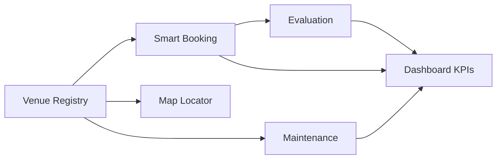

# Phase 2 Features | فهرست ویژگی‌ها

Priorities: **P0** = MVP required · **P1** = important · **P2** = nice-to-have · **P3** = future

---

## 1. Dashboard | داشبورد فاز ۲ (P0)

| ID | Feature | Status | Notes |
|----|---------|--------|-------|
| D-01 | KPI cards (venues, utilization, bookings today, satisfaction, maintenance) | ✅ | `phase2-dashboard.tsx` |
| D-02 | Occupancy line chart | ✅ | Recharts |
| D-03 | Booking distribution by venue type (bar) | ✅ | |
| D-04 | Satisfaction trend (area) | ✅ | |
| D-05 | Top 5 venues by usage | ✅ | Horizontal bar |
| D-06 | Filters: region, university | ✅ | Role-scoped options |
| D-07 | Recent activity feed | ✅ | From bookings |
| D-08 | Student simplified dashboard | ✅ | `student-dashboard.tsx` |
| D-09 | Loading skeleton | ✅ | Simulated 400ms |
| D-10 | Date range filter (backend) | P1 | UI hook ready |

---

## 2. Venue Registry | ثبت اماکن (P0)

| ID | Feature | Status | Notes |
|----|---------|--------|-------|
| V-01 | Grid and list views | ✅ | `/venues` |
| V-02 | Search and filters (type, status, university) | ✅ | |
| V-03 | Venue detail sheet (info, hours, facilities, rules) | ✅ | |
| V-04 | Create/edit dialog | ✅ | Client-side state |
| V-05 | Image gallery placeholder | ✅ | |
| V-06 | Utilization progress display | ✅ | |
| V-07 | Evaluations tab | ✅ | Mock reviews |
| V-08 | Maintenance history per venue | ✅ | From `mockMaintenanceTasks` |
| V-09 | Booking history per venue | ✅ | |
| V-10 | Server-side persistence | P1 | API `POST/PUT /venues` |

---

## 3. Smart Booking | رزرو هوشمند (P0)

| ID | Feature | Status | Notes |
|----|---------|--------|-------|
| B-01 | React Big Calendar (week/day/month) | ✅ | RTL, Persian formats |
| B-02 | Booking form (Zod + RHF) | ✅ | |
| B-03 | Venue search combobox | ✅ | |
| B-04 | Conflict detection (overlap, capacity, maintenance) | ✅ | `booking-utils.ts` |
| B-05 | Status workflow (pending → approved/rejected) | ✅ | Mock |
| B-06 | My bookings tabs (upcoming/past/cancelled) | ✅ | |
| B-07 | 24h cancellation policy | ✅ | |
| B-08 | Booking detail sheet | ✅ | |
| B-09 | Statistics cards (admin) | ✅ | Hidden for students |
| B-10 | Toast on submit/cancel | ✅ | sonner |
| B-11 | Recurring bookings | P2 | Type exists, UI not wired |
| B-12 | Email/SMS notifications | P3 | |

---

## 4. Map & Locator | نقشه اماکن (P0)

| ID | Feature | Status | Notes |
|----|---------|--------|-------|
| M-01 | Leaflet + OpenStreetMap tiles | ✅ | Dynamic import (no SSR) |
| M-02 | Type-based marker icons (8 types) | ✅ | |
| M-03 | Status styling (active/maintenance/closed) | ✅ | |
| M-04 | Rich popups + book CTA | ✅ | |
| M-05 | Multi-filter sidebar | ✅ | type, status, university, a11y |
| M-06 | Utilization heatmap toggle | ✅ | leaflet.heat |
| M-07 | Map statistics cards | ✅ | |
| M-08 | Auto-fit bounds to filtered venues | ✅ | |
| M-09 | Marker clustering | P2 | |
| M-10 | User geolocation | P3 | |

---

## 5. Maintenance & Evaluation | نگهداری و ارزیابی (P0)

| ID | Feature | Status | Notes |
|----|---------|--------|-------|
| N-01 | Maintenance request form (Zod) | ✅ | Categories, priority, photos |
| N-02 | Kanban board (reported → completed) | ✅ | Drag columns mock |
| N-03 | Preventive maintenance scheduler | ✅ | Frequencies, checklist |
| N-04 | Venue evaluation form (multi-rating) | ✅ | After booking |
| N-05 | Quality metrics aggregation | ✅ | Per-venue averages |
| N-06 | Maintenance statistics | ✅ | |
| N-07 | Assign technician | P1 | UI partial |
| N-08 | Cost tracking (estimated/actual) | P1 | Types ready |
| N-09 | Work order PDF export | P3 | |

---

## 6. Reports | گزارش‌ها (P1)

| ID | Feature | Status | Notes |
|----|---------|--------|-------|
| R-01 | Utilization report charts | ✅ | Mock `mockReportData` |
| R-02 | Export CSV/PDF | P2 | |
| R-03 | Scheduled reports | P3 | |

---

## 7. Audit | ممیزی (P1)

| ID | Feature | Status | Notes |
|----|---------|--------|-------|
| A-01 | Audit log page (placeholder table) | ✅ | `/audit` |
| A-02 | Immutable audit API | P1 | `GET /audit/logs` |
| A-03 | Filter by user/action/date | P2 | |

---

## 8. Platform & RBAC | زیرساخت (P0)

| ID | Feature | Status | Notes |
|----|---------|--------|-------|
| P-01 | Role-based navigation | ✅ | `sidebar.tsx` |
| P-02 | Route guard | ✅ | `role-guard.tsx` |
| P-03 | Data scoping by role | ✅ | `role-utils.ts` |
| P-04 | Demo role switcher | ✅ | Dev only — remove in prod |
| P-05 | Error boundaries | ✅ | |
| P-06 | Global toasts | ✅ | |
| P-07 | Dark/light theme | ✅ | |
| P-08 | PWA manifest | ✅ | `public/manifest.json` |
| P-09 | Real SSO | P1 | Phase 1 integration |

---

## Feature dependency graph

---

## Consolidation notes

This document merges and deduplicates:

- `BOOKING_SYSTEM_FEATURES.md` (booking detail)
- `MAP_SYSTEM_FEATURES.md` (map detail)
- `PHASE_2_COMPLETE.md` (summary checklist)

**Conflicts resolved:**

| Topic | Old doc A | Old doc B | Resolution |
|-------|-----------|-----------|------------|
| Map status | STRUCTURE: "placeholder" | MAP: "complete" | **Implemented** — STRUCTURE was outdated |
| Map packages | INSTALLATION: manual required | package.json has leaflet | **Installed** — note kept for fresh clones |
| Regional role label | "مدیر منطقه‌ای" | "دبیر منطقه‌ای" | **دبیر منطقه‌ای** per strategy brief |
