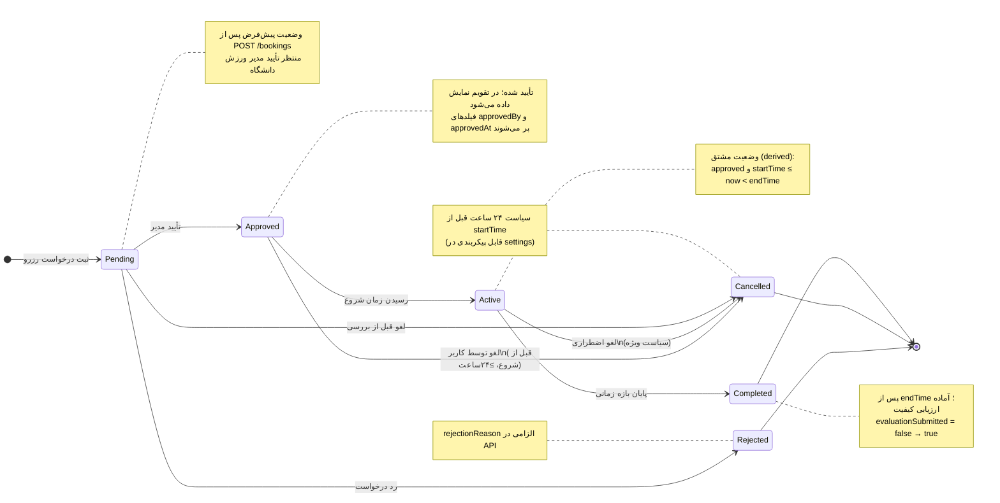

# State Diagram — Booking Lifecycle | نمودار وضعیت رزرو

**موجودیت:** `Booking` (رزرو)  
**مرجع نوع:** `lib/types.ts` → `BookingStatus`  
**نسخه:** 1.0.0

---

## ۱. نمای کلی

چرخه حیات رزرو از لحظه ثبت درخواست تا تکمیل یا خاتمه (رد / لغو) را نشان می‌دهد. وضعیت **فعال (Active)** در پایگاه داده به‌صورت جداگانه ذخیره نمی‌شود؛ زمانی که `status = approved` و زمان جاری بین `startTime` و `endTime` باشد، رزرو **از نظر عملیاتی فعال** است (قابل نمایش در تقویم و نقشه به‌عنوان «در حال برگزاری»).

---

## ۲. نمودار وضعیت

---

## ۳. جدول وضعیت‌ها

| وضعیت (EN) | برچسب فارسی | ذخیره در DB | توضیح |
|------------|-------------|:-----------:|-------|
| `pending` | در انتظار تأیید | ✅ | درخواست ثبت شده؛ مدیر بررسی می‌کند |
| `approved` | تأیید شده | ✅ | قبل از شروع زمان رزرو |
| `active` | فعال (در حال برگزاری) | ⚠️ مشتق | بین startTime و endTime |
| `completed` | تکمیل‌شده | ✅ | پس از پایان بازه؛ ورود به چرخه ارزیابی |
| `rejected` | رد شده | ✅ | با دلیل رد |
| `cancelled` | لغو شده | ✅ | توسط کاربر یا مدیر (طبق قوانین) |

---

## ۴. رویدادهای گذار (Triggers)

| از | به | رویداد / عمل | نقش |
|----|-----|--------------|-----|
| — | Pending | `POST /bookings` | دانشجو / مدیر |
| Pending | Approved | `PATCH .../status` → `approved` | مدیر ورزش دانشگاه |
| Pending | Rejected | `PATCH .../status` → `rejected` | مدیر ورزش دانشگاه |
| Approved | Active | زمان سیستم ≥ `startTime` | سیستم (cron / job) |
| Active | Completed | زمان سیستم ≥ `endTime` | سیستم (cron / job) |
| Pending / Approved | Cancelled | `POST .../cancel` | دانشجو (در صورت مجاز) |

---

## ۵. نگاشت به رابط کاربری

| وضعیت | نمایش در UI | فایل مرجع |
|-------|-------------|-----------|
| pending | Badge زرد «در انتظار» | `getBookingStatusColor` در `booking-utils.ts` |
| approved | Badge سبز «تأیید شده» | تقویم React Big Calendar |
| completed | تب «گذشته» + دکمه ارزیابی | `bookings/page.tsx` |
| rejected / cancelled | تب «لغوشده» | فیلتر `my bookings` |

---

## ۶. یادداشت پیاده‌سازی

1. **وضعیت Active:** برای سادگی MVP، می‌توان فقط در UI از `approved` + بازه زمانی استنتاج کرد؛ در فاز backend می‌توان job شبانه‌روزی وضعیت را به `completed` به‌روز کند.
2. **ارزیابی:** فقط وقتی `status === 'completed'` و `evaluationSubmitted !== true` باشد، فرم ارزیابی فعال است ([FEATURES.md](./FEATURES.md) N-04).
3. **تداخل:** در وضعیت‌های `pending` و `approved`، رزرو در بررسی تداخل (`booking-utils.ts`) لحاظ می‌شود.

---

## پیوندها

- [BPMN.md](./BPMN.md) — فرآیند گام‌به‌گام رزرو
- [USECASES.md](./USECASES.md) — موارد کاربرد
- [DATA-MODELS.md](./DATA-MODELS.md) — مدل `Booking`
